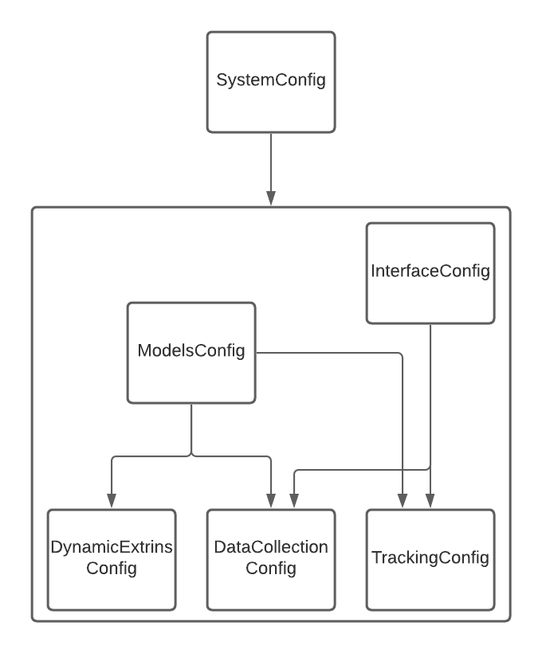
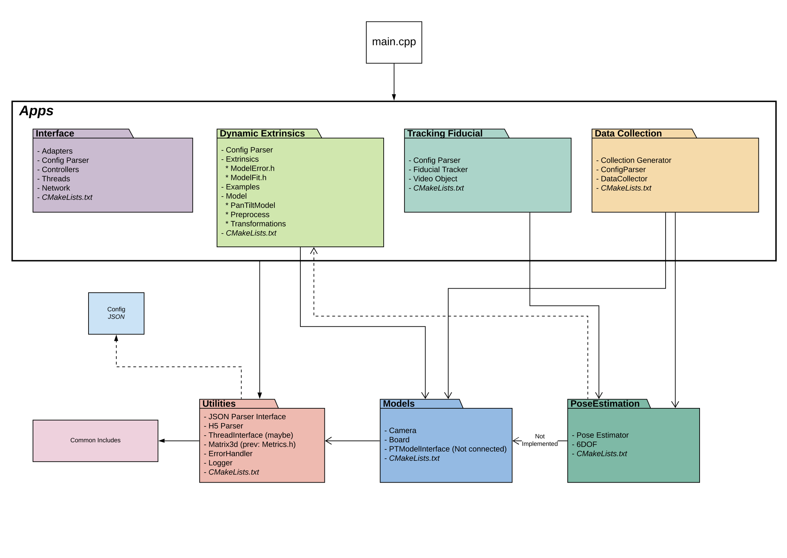

# Live Metrology 
### Goal: TODO
## HRL Documentation
For best viewing results, we suggest using a markdown viewer like [StackEdit](https://stackedit.io) or any other framework/IDE that supports images, diagrams, etc.
-   [\*MSVS Markdown editor](https://marketplace.visualstudio.com/items?itemName=MadsKristensen.MarkdownEditor) 
-   if using StackEdit, simply copy/paste this file

\* MSVS --> Microsoft Visual Studio

## Contents
1. [Project Overview](#project-overview)
    -   JSON [configurations](#config) 
    -   JSON [hierarchy](#hierarchy)
    -   Setting runtime environment (ie. `SystemConfig.json`)
        -   Selecting running [mode](#mode)
        -   Specifing target [components, pairs, and world-frame](#components).
2. [Dependencies](#dependencies)
	- [external](#external-dependencies) (libraries, inclusions, etc.)
	- [internal](#internal-dependencies) (module diagram)
3. How to..
	- [build](#building-the-project) the project.
	- [run](#running-the-project) the project.
4. [Logger](#logger)
    -   If the program crashes where should I look?
5. [Images](#images)
    - [File Structure](#file-structure) (tree diagram)

## Project Overview
This document will walk the user through the build, installation, and normal/expected operating procedures of the available modules. Included in this project are three applications:
1) Data Collection
2) Dynamic Extrinsics 
3) Fiducial Tracking

Note: there exists and 4th "Interface" mode which provides the client a live, user-controlled environment based on the target components specified in `InterfaceConfig.json`

Of these modules, two (Data Collection & Fiducial Tracking) require the use of an interface module, responsible for handling communications between the associated camera(s) and PTU(s). For HRL, we have created such a module called `LiMeInterface`.

Note: it is possible to run the Fiducial Tracker offline, but requires pre-acquired images. As such the offline operation will be omitted from this document. Please refer to TrackingFiducial/README.txt for more info.

### Config
There exist 5 JSON configuration files, which aim to give the client easier access to internal variables, without intimate knowledge of the code. These files are:
1)  SystemConfig.json
    -   specify the components, pairs, and world-frame
2)  InterfaceConfig.json
    -   initialize devices (cameras, ptus, networks, etc)
3)  ModelConfig.json
    -   camera and fiducial models
4)  DataCollectionConfig.json
    -   specifies staging areas/points, collection patters (raster vs random), and collection zones
5)  DynamicExtrinsicsConfig.json
    -   specifies H5 datasets for fiducial position (Bottom/Top Left/Right), fitting algorithm parameters, and cad model storage location 
6)  TrackingConfig.json
    -   specifies staging area (for respective instances),  

Configurations are examined with a individually in their respective module README.md. 

### Hierarchy

 
### Mode
In order for to run a desired software package,  one will need to select the desired running mode. Available modes include:
1)  `interface` (Default)
    -   allows client to manually control PTU(s) and view connected cameras
        -   PTU Controls: `w -> up`, `a -> left`, `s -> down`, and `d -> right`
2)  `data_colletion`
    -   collect a round of data for offline model training/fitting
3)  `dynamic_extrinsic` 
    -   run offline dynamic extriniscs model fitting
4)  `tracking` 
    -   track the fiducial board using a combination of WFOV and NFOV camera sensors
    
Selecting the desired mode can be do via the `SystemConfig.json` in the following `run` field:

       "mode": {
           "run": "<client-selected-mode>",
           "components": [ "alpha", "beta" ], 
           "_comment": "Options: <interface>, <data_collection>, <dynamic_extrinsics>, and <tracking>."
        } 
 
**Reminder:** Default running mode will be `interface`, if no mode specified or unrecognized. Additionally recognized modes can be added to `Presets.h` and listened for in `SystemJSONParser`.

### Components
The `components` section is for designating which pairs (ptu, camera, and dynamic extrinsics) the system should target. Each pair is marked by a unique ID (that the user is responsible for maintaining). An example pair may look as follows:

        "alpha": {
              "camera": {
                "id": "C0",
                "intrinsics": { "id": "xi_I0" }
              },
              "ptu": { "id": "P0" },
              "extrinsics": {"id": "Ximea_id0_Imperx"},
              "_comment": "The value assigned is the associated ID"
        }

In the above example, 
-   `camera:id` points to a camera specified in `InterfaceConfig.json`
-   `camera:intirinsics:id` points to the camera intrinisics specified in `ModelsConfig.json`
-   `ptu:id` points to a instance of PTU and the associated network in `InterfaceConfig.json`
-   `extrinsics:id` (only necessary for `mode=tracking`) points to the dynamic model fitting between cameras in `TrackingConfig.json`
    
## Dependencies
### External Dependencies

Control Software:
-   [CMake](https://cmake.org/download/) v3.15 (or higher)

Camera SDK:
-   [ximea](https://www.ximea.com/support/wiki/apis/apis)
-   [imperx](https://www.imperx.com/downloads/)

Libraries:
-   [OpenCV](https://github.com/opencv/opencv) v4.2.0
-   [Eigen3](https://gitlab.com/libeigen/eigen) v3.3
-   [HDF5](https://bitbucket.hdfgroup.org/projects/HDFFV/repos/hdf5/browse) v1.12.0
-   [L-BFGS](https://github.com/yixuan/LBFGSpp/)

Header-Only Inclusion:
-   [nlohmann_json](https://github.com/nlohmann/json) 
-   [aoba](https://gist.github.com/rezoo/5656056) a.k.a. CppNpy
-   [CLI11](https://github.com/CLIUtils/CLI11)

The distinction between "libraries" and "header-only" was made to describe the separation between expected installation locations within the project. From the project root `Code`, the follwoing directories reside as direct children:
-   `lib/` (empty - files are included as zip)
-   `include/`
-   `src/`

In the above structure, 
-   "libraries" reside in `lib/`
-   "header-only" reside in `include/`
-   while `src/` is the root of the top-level `CMakeList.txt`

Note: a complete look at the file structure underneath `src/` can be found [here](#file-structure).

### Internal Dependencies


## How to...
### Building the Project

When building the project, we chose CMake, which allows cross platform development and makes external package inclusion easier/cleaner. But before we proceed with building, we need to unzip our pre-built libraries into our `lib/` directory. Once complete, we're ready to begin building.

Steps to build:
-  Create `build/` directory underneath `src/`, then enter `build/`
-  From inside `build/`, we need to run the following:

```
cmake -DCMAKE_CXX_FLAGS="-DNDEBUG -DBUILD_EXAMPLES=1" ..
```

The flags passed in to this call instruct the compiler: (OPTIONAL, but recommended)
-   run `Eigen3` with debugging disabled. This greatly increases matrix operations (~100x speed up - need to verify again)
-   build the standalone DynamicExtrinsic offline training code as an executable

**Windows (CMake GUI)**
-   Run/click `configure`, then ensure that the above flags are set accordingly
-   Once CMake has finished configuring, generate the code by running/clicking `generate` 
-   Then open the project and use MSVS to finish the build process.

Note: it has been observed that MSVS confuses the "start-up" project. It may be necessary to change this to `LiveMetrology` in the "Solution Explore". This can be done by right clicking on `LiveMetrology` (in the Solution Explore) and selecting "Set as startup project".

**Linux/Unix (Terminal)**
-   Type the command directly into a terminal window at the `build/` directory.   
-   Once finished, run `make`.

Note: modules like Data Collection and LiMeInterface are excluded from linux build.

#### CMake Expected Output (or something similar)

```
Selecting Windows SDK version 10.0.17134.0 to target Windows 6.1.7601.

======================
LiveMetrology - SETUP
CMAKE_VERSION 3.17.1
======================
Setting PREFIX_PATH for the Windows7 PC in the lab: HOST=HRLE05372
Environment
PROJECT_PATH : C:/Metrology/src/Metrology2020_VS/Metrology2020
CMAKE_MODULE_PATH : C:/Metrology/src/Metrology2020_VS/Metrology2020/cmake
CMAKE_PREFIX_PATH : C:/Metrology/lib
CMAKE_INCLUDE_PATH : C:/Metrology/include
======================
======================
Linking Sub-Directories (of: LiveMetrology) - BEGIN
======================

======================
Utilities - SETUP
CMAKE_VERSION 3.17.1
======================
Environment
PROJECT_PATH : C:/Metrology/src/Metrology2020_VS/Metrology2020/Utilities
CMAKE_MODULE_PATH : C:/Metrology/src/Metrology2020_VS/Metrology2020/cmake
CMAKE_PREFIX_PATH : C:/Metrology/lib
CMAKE_INCLUDE_PATH : C:/Metrology/include
======================
Found HDF5: v1.12.0
	Root: C:/Metrology/lib/HDF5/install/cmake/hdf5
	Includes: C:/Metrology/lib/HDF5/install/include
	Libs: hdf5_cpp-shared
OpenCV ARCH: x64
OpenCV RUNTIME: vc15
OpenCV STATIC: OFF
Found OpenCV: C:/Metrology/lib/OpenCV (found suitable version "4.2.0", minimum required is "4.2") found components: core highgui 
Found OpenCV 4.2.0 in C:/Metrology/lib/OpenCV/x64/vc15/lib
You might need to add C:\Metrology\lib\OpenCV\x64\vc15\bin to your PATH to be able to run your applications.
Found OpenCV: v4.2.0
	Root: C:/Metrology/lib/OpenCV
	Includes: C:/Metrology/lib/OpenCV/include
	Libs: opencv_core;opencv_highgui
Found CommonIncludes Directory(s): C:/Metrology/src/Metrology2020_VS/Metrology2020/CommonIncludes
======================
Utilities - FINISHED
======================


======================
Models - SETUP
CMAKE_VERSION 3.17.1
======================
Environment
PROJECT_PATH : C:/Metrology/src/Metrology2020_VS/Metrology2020/Models
CMAKE_MODULE_PATH : C:/Metrology/src/Metrology2020_VS/Metrology2020/cmake
CMAKE_PREFIX_PATH : C:/Metrology/lib
CMAKE_INCLUDE_PATH : C:/Metrology/include
======================
Found Eigen: v3.3.90
	Root: C:/Metrology/lib/eigen3
	Includes: C:/Metrology/lib/eigen3/include/eigen3
OpenCV ARCH: x64
OpenCV RUNTIME: vc15
OpenCV STATIC: OFF
Found OpenCV: C:/Metrology/lib/OpenCV (found suitable version "4.2.0", minimum required is "4.2") found components: core aruco 
Found OpenCV 4.2.0 in C:/Metrology/lib/OpenCV/x64/vc15/lib
You might need to add C:\Metrology\lib\OpenCV\x64\vc15\bin to your PATH to be able to run your applications.
Found OpenCV: v4.2.0
	Root: C:/Metrology/lib/OpenCV
	Includes: C:/Metrology/lib/OpenCV/include
	Libs: opencv_core;opencv_aruco
Found CommonIncludes Directory(s): C:/Metrology/src/Metrology2020_VS/Metrology2020/CommonIncludes
======================
Models - FINISHED
======================


======================
DynamicExtrinsics (v2.0.0) - SETUP
CMAKE_VERSION 3.17.1
======================
Adopted CMake Policy CMP0074 ...
Environment
PROJECT_PATH : C:/Metrology/src/Metrology2020_VS/Metrology2020/DynamicExtrinsics
CMAKE_MODULE_PATH : C:/Metrology/src/Metrology2020_VS/Metrology2020/cmake
CMAKE_PREFIX_PATH : C:/Metrology/lib
CMAKE_INCLUDE_PATH : C:/Metrology/include
======================
Found Eigen: v3.3.90
	Root: C:/Metrology/lib/eigen3
	Includes: C:/Metrology/lib/eigen3/include/eigen3
OpenCV ARCH: x64
OpenCV RUNTIME: vc15
OpenCV STATIC: OFF
Found OpenCV: C:/Metrology/lib/OpenCV (found version "4.2.0") found components: core aruco 
Found OpenCV 4.2.0 in C:/Metrology/lib/OpenCV/x64/vc15/lib
You might need to add C:\Metrology\lib\OpenCV\x64\vc15\bin to your PATH to be able to run your applications.
Found OpenCV: v4.2.0
	Root: C:/Metrology/lib/OpenCV
	Includes: C:/Metrology/lib/OpenCV/include
	Libs: opencv_core;opencv_aruco
Found CommonIncludes Directory(s): C:/Metrology/src/Metrology2020_VS/Metrology2020/CommonIncludes
Found L-BFGS: v1.0.1
	Root: C:/Metrology/lib/LBFGSpp
	Includes: C:/Metrology/lib/LBFGSpp
Examples: STATUS - Building...
Examples: STATUS - Success.
======================
DynamicExtrinsics - FINISHED
======================


======================
PoseEstimation - SETUP
CMAKE_VERSION 3.17.1
CMAKE_INCLUDE_PATH : C:/Metrology/include
======================
Environment
PROJECT_PATH : C:/Metrology/src/Metrology2020_VS/Metrology2020/PoseEstimation
CMAKE_MODULE_PATH : C:/Metrology/src/Metrology2020_VS/Metrology2020/cmake
CMAKE_PREFIX_PATH : C:/Metrology/lib
======================
OpenCV ARCH: x64
OpenCV RUNTIME: vc15
OpenCV STATIC: OFF
Found OpenCV 4.2.0 in C:/Metrology/lib/OpenCV/x64/vc15/lib
You might need to add C:\Metrology\lib\OpenCV\x64\vc15\bin to your PATH to be able to run your applications.
Found OpenCV: v4.2.0
	Root: C:/Metrology/lib/OpenCV
	Includes: C:/Metrology/lib/OpenCV/include
	Libs: opencv_core;opencv_aruco
Found Eigen: v3.3.90
	Root: C:/Metrology/lib/eigen3
	Includes: C:/Metrology/lib/eigen3/include/eigen3
======================
PoseEstimation - FINISHED
======================


======================
LiMeInterface - SETUP
CMAKE_VERSION 3.17.1
======================
Environment
PROJECT_PATH : C:/Metrology/src/Metrology2020_VS/Metrology2020/LiMeInterface
CMAKE_MODULE_PATH : C:/Metrology/src/Metrology2020_VS/Metrology2020/cmake
CMAKE_PREFIX_PATH : C:/Metrology/lib
CMAKE_INCLUDE_PATH : C:/Metrology/include;C:/include
======================
Searching for package Ximea in TARGET_PATH=C:/Metrology/lib/Ximea
  Ximea_INCLUDE_DIRS: C:/Metrology/lib/Ximea/include
  Ximea_LIBRARIES: C:/Metrology/lib/Ximea/lib/x64/xiapi64.lib
Found Ximea: v
	Root: 
	Includes: C:/Metrology/lib/Ximea/include
	Libs: C:/Metrology/lib/Ximea/lib/x64/xiapi64.lib
Found ImperX: v1.0.2
	Root: C:/Metrology/lib/ImperX
	Includes: C:/Metrology/lib/ImperX/inc
	Libs: C:/Metrology/lib/ImperX/lib/win64_x64/ipximageapi.lib;C:/Metrology/lib/ImperX/lib/win64_x64/ipxdisplay.lib;C:/Metrology/lib/ImperX/lib/win64_x64/IpxCameraApi.lib;C:/Metrology/lib/ImperX/lib/win64_x64/IpxCameraGuiApi.lib
OpenCV ARCH: x64
OpenCV RUNTIME: vc15
OpenCV STATIC: OFF
Found OpenCV: C:/Metrology/lib/OpenCV (found suitable version "4.2.0", minimum required is "4.2") found components: core 
Found OpenCV 4.2.0 in C:/Metrology/lib/OpenCV/x64/vc15/lib
You might need to add C:\Metrology\lib\OpenCV\x64\vc15\bin to your PATH to be able to run your applications.
Found OpenCV: v4.2.0
	Root: C:/Metrology/lib/OpenCV
	Includes: C:/Metrology/lib/OpenCV/include
	Libs: opencv_core
Found CommonIncludes Directory(s): C:/Metrology/src/Metrology2020_VS/Metrology2020/CommonIncludes
======================
LiMeInterface - FINISHED
======================


======================
DataCollection (v2.0.0) - SETUP
CMAKE_VERSION 3.17.1
======================
Adopted CMake Policy CMP0074 ...
======================
Environment
PROJECT_PATH : C:/Metrology/src/Metrology2020_VS/Metrology2020/DataCollection
CMAKE_MODULE_PATH : C:/Metrology/src/Metrology2020_VS/Metrology2020/cmake
CMAKE_PREFIX_PATH : C:/Metrology/lib
CMAKE_INCLUDE_PATH : C:/Metrology/include;C:/include
======================
OpenCV ARCH: x64
OpenCV RUNTIME: vc15
OpenCV STATIC: OFF
Found OpenCV: C:/Metrology/lib/OpenCV (found suitable version "4.2.0", minimum required is "4.2") 
Found OpenCV 4.2.0 in C:/Metrology/lib/OpenCV/x64/vc15/lib
You might need to add C:\Metrology\lib\OpenCV\x64\vc15\bin to your PATH to be able to run your applications.
Found OpenCV: v4.2.0
	Root: C:/Metrology/lib/OpenCV
	Includes: C:/Metrology/lib/OpenCV/include
	Libs: opencv_calib3d;opencv_core;opencv_dnn;opencv_features2d;opencv_flann;opencv_gapi;opencv_highgui;opencv_imgcodecs;opencv_imgproc;opencv_ml;opencv_objdetect;opencv_photo;opencv_stitching;opencv_video;opencv_videoio;opencv_aruco;opencv_bgsegm;opencv_bioinspired;opencv_ccalib;opencv_datasets;opencv_dnn_objdetect;opencv_dnn_superres;opencv_dpm;opencv_face;opencv_fuzzy;opencv_hdf;opencv_hfs;opencv_img_hash;opencv_intensity_transform;opencv_line_descriptor;opencv_optflow;opencv_phase_unwrapping;opencv_plot;opencv_quality;opencv_rapid;opencv_reg;opencv_rgbd;opencv_saliency;opencv_shape;opencv_stereo;opencv_structured_light;opencv_superres;opencv_surface_matching;opencv_text;opencv_tracking;opencv_videostab;opencv_xfeatures2d;opencv_ximgproc;opencv_xobjdetect;opencv_xphoto
Found CommonIncludes Directory(s): C:/Metrology/src/Metrology2020_VS/Metrology2020/CommonIncludes
======================
DataCollection - FINISHED
======================


======================
trackfiducial - SETUP
CMAKE_VERSION 3.17.1
======================
Already defined: PREFIX_PATH=C:/Metrology/lib
Environment:
PROJECT_PATH : C:/Metrology/src/Metrology2020_VS/Metrology2020/TrackingFiducial
CMAKE_MODULE_PATH : C:/Metrology/src/Metrology2020_VS/Metrology2020/cmake;C:/Metrology/src/Metrology2020_VS/Metrology2020/TrackingFiducial/..//cmake
CMAKE_PREFIX_PATH : C:/Metrology/lib
======================
OpenCV ARCH: x64
OpenCV RUNTIME: vc15
OpenCV STATIC: OFF
Found OpenCV: C:/Metrology/lib/OpenCV (found version "4.2.0") found components: core highgui aruco 
Found OpenCV 4.2.0 in C:/Metrology/lib/OpenCV/x64/vc15/lib
You might need to add C:\Metrology\lib\OpenCV\x64\vc15\bin to your PATH to be able to run your applications.
Found OpenCV: v4.2.0
	Root: C:/Metrology/lib/OpenCV
	Includes: C:/Metrology/lib/OpenCV/include
	Libs: opencv_core;opencv_highgui;opencv_aruco
======================
Linking Sub-Directories (of: LiveMetrology) - FINISHED
======================
======================
LiveMetrology - FINISHED
======================

Configuring done
```


### Running the Project

Once the project has build successfully, we're ready to run one of our three target applications: 
-   Data Collection,
-   Dynamic Parameter Fitting, or
-   Fiducial Tracking

The running mode is specified in `SystemConfig.json` and is discussed in greater detail in the above [section](#mode).

## Logger
In the case that the user specified runtime environment is invalid or fails to execute properly, the first place the user should check are the log files. By default, the `Logs` directory will be auto-generated (if doesn't exist) and a file called `report.out` will track messages (ie debugging, info, warnings, errors). This directory is auto-generated in the same location as the built binary.

The logger works in tandem with the `ErrorHandler`, which has the responsibility of monitoring the current execution state of the program. If an error execeeds the user specified threshold, the program will automatically exit. To set this threshold call:

        ErrorHandler::getInstance().setListeningLevel(<listening-level>)
        
Listening levels are declared in `CommonIncludes/Shared/SharedStructs.h`. To add a new message to a report, via the `ErrorHandler`, use:

        ErrorHandler::getInstance().report(<msg>, <logging-level>, <target-instance>)
        
Where...
-   `msg` is the desired text to be reported
-   `logging-level` (Default: `Shared::Error::Severity::INFO`) optional user specified logging level
-   `target-instance` (Default: `report.out`) optional user specified target log file

If we wish to specify a separate log file target, we need to add the instance first, via the call:

        Logger::getInstance().addInstance(<log-handle-name>)
        
## Images

#### File Structure
```
.
├── cmake
│   ├── FindCommonIncludes.cmake.bak
│   ├── FindCppNpy.cmake
│   ├── FindImperX.cmake
│   ├── FindLBFGSpp.cmake
│   ├── FindXimea.cmake
│   └── Functions.cmake
├── CMakeLists.txt
├── CommonIncludes
│   └── Shared
│       ├── DataCollectionConfig.h
│       ├── DynamicExtrinsicConfig.h
│       ├── InterfaceConfig.h
│       ├── JSONParser.h
│       ├── OSDefines.h
│       ├── Presets.h
│       └── SharedStructs.h
├── Config
│   ├── DataCollectionConfig.json
│   ├── DynamicExtrinsicsConfig.json
│   └── InterfaceConfig.json
├── DataCollection
│   ├── CMakeLists.txt
│   ├── CollectionGenerator
│   │   ├── CollectionGenerator.cpp
│   │   └── CollectionGenerator.h
│   ├── ConfigParser
│   │   ├── DataCollectionJSONParser.cpp
│   │   └── DataCollectionJSONParser.h
│   ├── DataCollector
│   │   ├── DataCollector.cpp
│   │   └── DataCollector.h
│   └── main.cpp
├── DynamicExtrinsics
│   ├── CMakeLists.txt
│   ├── ConfigParser
│   │   ├── DynamicExtrinsicsJSONParser.cpp
│   │   └── DynamicExtrinsicsJSONParser.h
│   ├── Examples
│   │   └── main.cpp
│   ├── Extrinsics
│   │   ├── ModelError.h
│   │   └── ModelFit.h
│   ├── Model
│   │   ├── PanTiltModel.h
│   │   ├── Preprocess.h
│   │   └── Transformations.h
│   └── README.md
├── LiMeInterface
│   ├── Adapters
│   │   ├── GenICamInterface
│   │   │   ├── GenICamAdapterInterface.cpp
│   │   │   ├── GenICamAdapterInterface.h
│   │   │   └── GenICam_API.h
│   │   ├── ImperX
│   │   │   ├── ImperxAdapter.cpp
│   │   │   ├── ImperxAdapter.h
│   │   │   └── Imperx.h
│   │   └── Ximea
│   │       ├── XimeaAdapter.cpp
│   │       ├── XimeaAdapter.h
│   │       └── Ximea.h
│   ├── CMakeLists.txt
│   ├── ConfigParser
│   │   ├── InterfaceJSONParser.cpp
│   │   └── InterfaceJSONParser.h
│   ├── Controllers
│   │   ├── Camera
│   │   │   ├── CameraInterface.cpp
│   │   │   └── CameraInterface.h
│   │   └── PanTilt
│   │       ├── PanTiltController.cpp
│   │       ├── PanTiltController.h
│   │       └── PTUCommands.h
│   ├── Network
│   │   ├── ConnectionInterface.h
│   │   ├── Network.cpp
│   │   ├── Network.h
│   │   └── Tools.h
│   ├── PhotoAlbum
│   │   ├── PhotoAlbum.cpp
│   │   └── PhotoAlbum.h
│   └── Threads
│       ├── DeviceInterface
│       │   ├── DeviceInterface.cpp
│       │   └── DeviceInterface.h
│       ├── ImperX
│       │   ├── ImperxThread.cpp
│       │   └── ImperxThread.h
│       ├── PanTilt
│       │   ├── PanTiltThread.cpp
│       │   └── PanTiltThread.h
│       └── Ximea
│           ├── XimeaThread.cpp
│           └── XimeaThread.h
├── main.cpp
├── Models
│   ├── Board
│   │   └── FiducialModel.h
│   ├── Camera
│   │   └── CameraModel.h
│   ├── CMakeLists.txt
│   └── PT
│       └── PTModelInterface.h
├── PoseEstimation
│   ├── CMakeLists.txt
│   ├── PoseEstimator.cpp
│   ├── PoseEstimator.h
│   └── SixDOF.h
├── README.md (*this document*)
├── TrackingFiducial
│   ├── CMakeLists.txt
│   ├── FiducialTracker.cpp
│   ├── FiducialTracker.h
│   ├── FTVideoObject.cpp
│   ├── FTVideoObject.h
│   ├── main.cpp
│   ├── output_gt.txt
│   ├── README.txt
│   ├── ximea200_01.jpg
│   ├── Ximea_TV_Left.jpg
│   └── Ximea_TV_Right.jpg
└── Utilities
    ├── CMakeLists.txt
    ├── ErrorHandler
    │   ├── ErrorHandler.cpp
    │   └── ErrorHandler.h
    ├── H5
    │   └── H5Parser.h
    ├── JSONParser
    │   ├── JSONParser.cpp
    │   └── JSONParser.h
    ├── Logger
    │   ├── Logger.cpp
    │   └── Logger.h
    ├── Matrix
    │   └── Matrix3d.h
    ├── OpenCVHelpers
    │   ├── VideoObject.cpp
    │   ├── VideoObject.h
    │   ├── VideoRecorder.cpp
    │   └── VideoRecorder.h
    ├── ThreadInterface
    │   ├── ThreadInterface.cpp
    │   └── ThreadInterface.h
    └── Tools.h
```

#### TODO - unused
### Interface Config JSON
-   Camera(s)
-   PTU(s)

### Data Collection JSON
-   positions
    -   pan & tilt angle ranges (deg) and divisions on each axis; where collection site grid should be constructed
-   camera(s)
    -   intrinsics file path
    -   distortion coeff file path
-   output H5 file path

### Dynamic Extrinsics JSON
-   fiducial positions : global collection position (path to H5 file)
    -   `top_left`
    -   `top_right`
    -   `bottom_left`
    -   `bottom_right`
-   dataset 
    -   storage order
    -   strip max/min pan/tilt based upon range
-   model (json)
    -   input path (optional)
    -   output path
-   cameras
    -   intrinsic file path
    -   distortion coeff file path